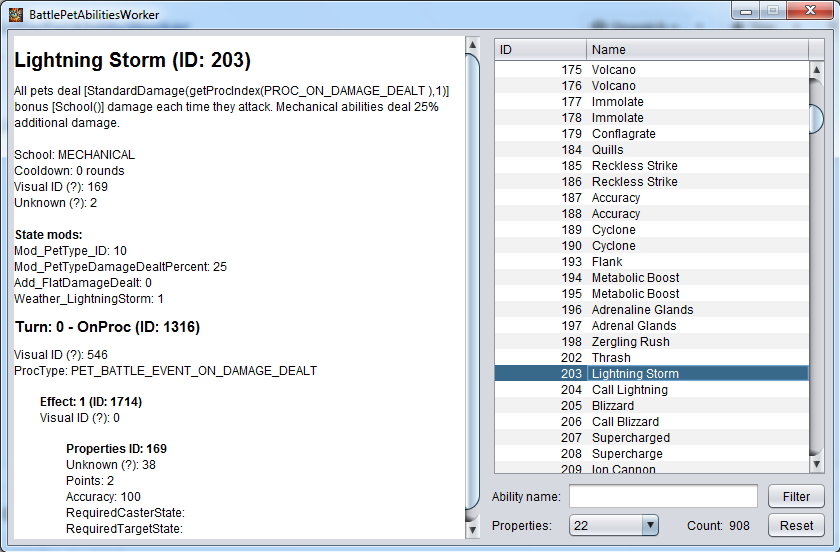

BattlePetAbilityWorker
======================

BattlePetAbilityWorker is a tool to browse and display information about World of Warcraft battle pet abilities.
It is written in java (NetBeans).

Instructions
------------

You need these files placed in the same folder as BattlePetAbilityWorker.jar:

- BattlePetAbility.db2
- BattlePetAbilityEffect.db2
- BattlePetAbilityState.db2
- BattlePetAbilityTurn.db2
- BattlePetEffectProperties.db2
- BattlePetState.db2

